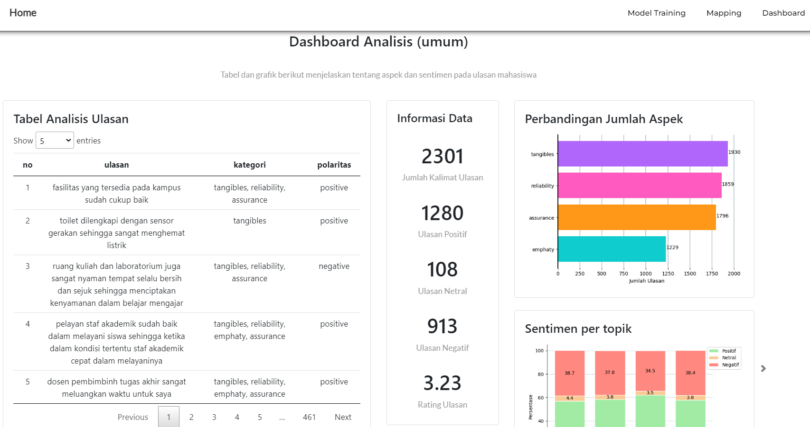
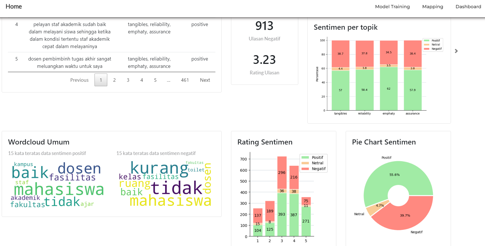
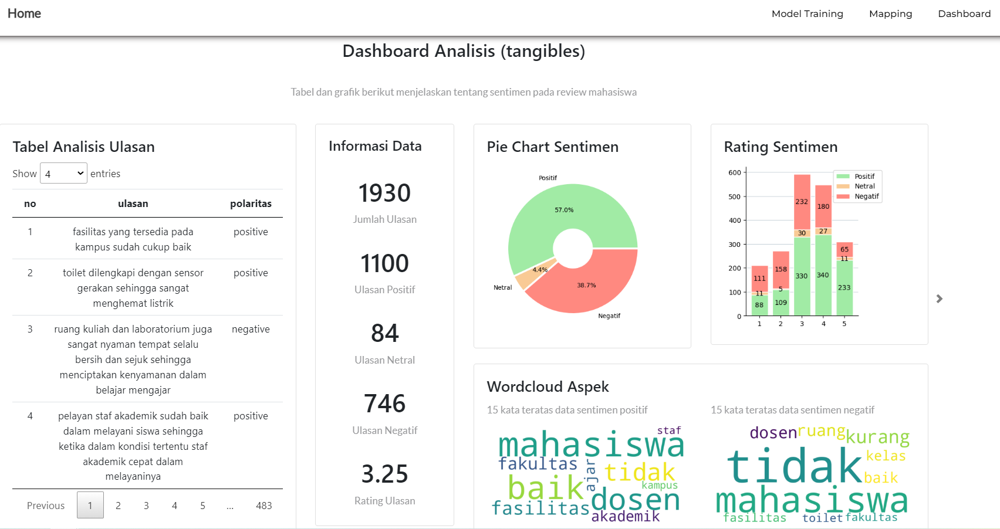

## Table of contents

- [General info](#general-info)

## General info

This project aims to perform Aspect-Oriented Sentiment Analysis (AOSA) on student reviews data. It will identify aspects discussed by students in the reviews using the Latent Dirichlet Allocation method. Additionally, the sentiment in the reviews will be calculated using a sentiment lexicon to determine whether the reviews are positive, negative, or neutral. The system runs on the web using the Python programming language with Flask, GenSim, Pandas, Matplotlib library, and also the JavaScript programming language. The main feature of this system is a dashboard analysis that includes various visualizations, such as bar charts, 100% stacked bar charts, pie charts, and word cloud charts. These visualizations will help users gain a better understanding of the data and make informed decisions for the company.

